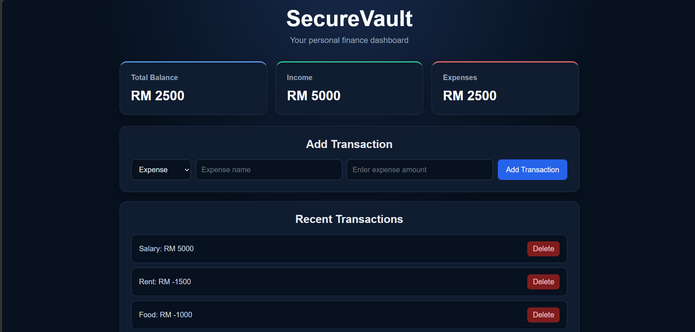

# SecureVault

A responsive personal finance tracker built with React and Supabase. It allows users to sign up, record income and expenses, view their balance, and manage recent transactions securely.

# Features
User accounts with email authentication (Supabase Auth)

Add income and expense transactions

Automatically calculate income, expenses, and balance

Delete transactions

Transactions stored securely in a Supabase (Postgres) database, scoped per user

Row Level Security (RLS) policies ensure users can only access their own data

Change input labels based on transaction type

Responsive design for desktop and smaller screens


#Technologies Used
React
JavaScript
CSS
Vite
Supabase (Auth + Postgres database)
Git and GitHub

## Run Locally

1. Clone the repository:

git clone https://github.com/yusuf2303/securevault-finance-tracker.git

2. Enter the project folder:

```bash
cd securevault-finance-tracker
```

3. Install the required packages:

```bash
npm install
```

4. Start the application:

```bash
npm run dev
```

## Future Improvements


Transaction categories
Monthly budgets
Charts and financial reports

## Live Demo

[Open SecureVault](https://securevault-finance-tracker.vercel.app/)

## Preview


